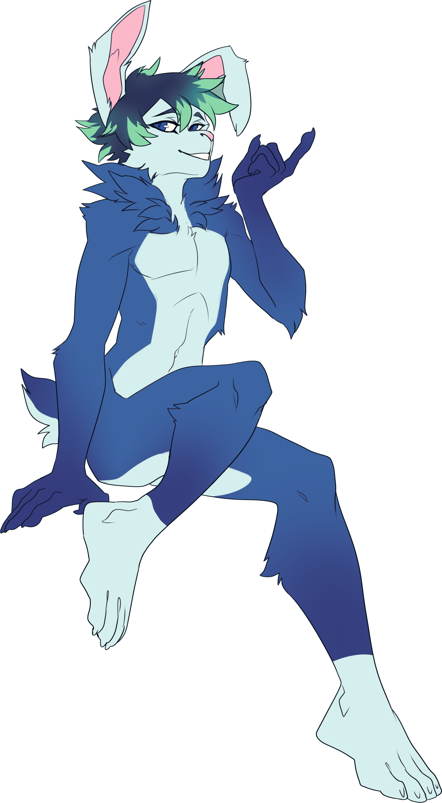

  <!--  -->
  
  <h1 align="left">Hi, I'm Astra!</h1>

## About Me

- 🐰 i'm a furry and a rabbit
- 💻 i'm an originally-self-taught-but-now-does-professional-stuff hobby developer
- 👀 i’m interested in making neat things, playing games, and being chill
- 🐍 python is my go-to language for most lil things that i need to automate quickly
- 🌱 i’ve spent a little time practicing golang and typescript, and typescript was more related to my day-to-day, so i mainly focused on that for a while
- 💎 i'm also practicing ruby on rails, because it is fun!
- 📫 [website: astrabun.com](https://astrabun.com)

## Environment

<!---->
